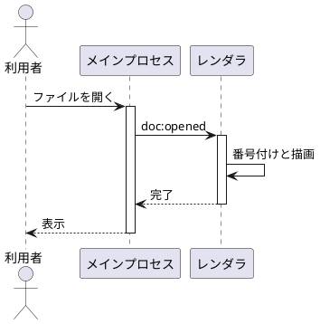
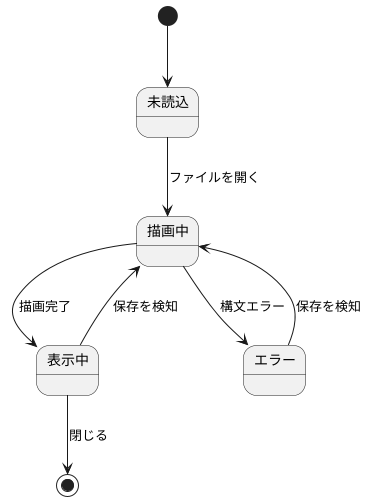
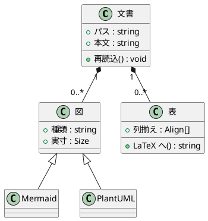
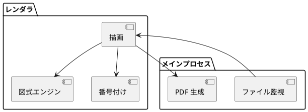
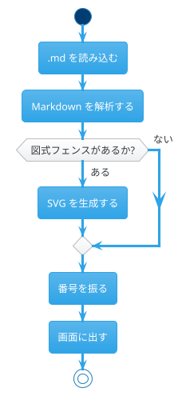

# PlantUML 描画の確認 {#sec:puml}

Java を使わず、同梱の JavaScript 実装だけで描けているかを確かめるためのファイル。
図式ごとに必要なレイアウト方式が違うので、種類を変えて並べてある。

## 内部レイアウトを使う図

## Graphviz のレイアウトを使う図

## テーマ指定

参照の確認: 流れは [@fig:seq]、構造は [@fig:class]、状態は [@fig:state] を参照。
