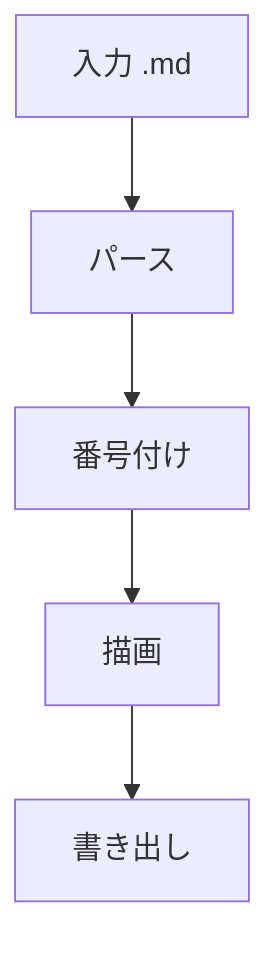
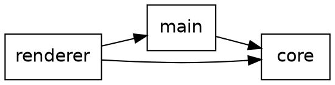
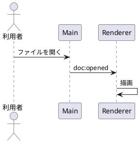

# 序論 {#sec:intro}

本稿は mdview の表示確認用サンプルである。詳しくは [@sec:method] を参照。
インライン数式 $E = mc^2$ と、次のディスプレイ数式を含む。

$$
\int_{0}^{\infty} e^{-x^2}\,dx = \frac{\sqrt{\pi}}{2}
$$

## 背景

外部画像の表示確認。

{#fig:arch}

# 手法 {#sec:method}

## 処理の流れ



## 構成要素





## 実験条件

: 実験条件 {#tbl:cond}

| 項目 | 記号 | 値 | 備考 |
|:-----|:----:|---:|:-----|
| 試行回数 | $N$ | 10 | 100% 完了 |
| しきい値 | `theta` | 0.5 | a_b & c |
| 補正 | $\alpha$ | 1.25 | **重要** |

条件は [@tbl:cond]、構成は [@fig:arch]、流れは [@fig:flow] に示す。
未定義の参照 [@fig:missing] は警告表示になる。

### 細目

項レベルの見出し。引用と箇条書き。

> 引用文のサンプル。

- 箇条書き 1
- 箇条書き 2
  - 入れ子

1. 番号付き
2. 箇条書き

```ts
// 通常のコードブロックは図として扱わない
const x: number = 1
```
